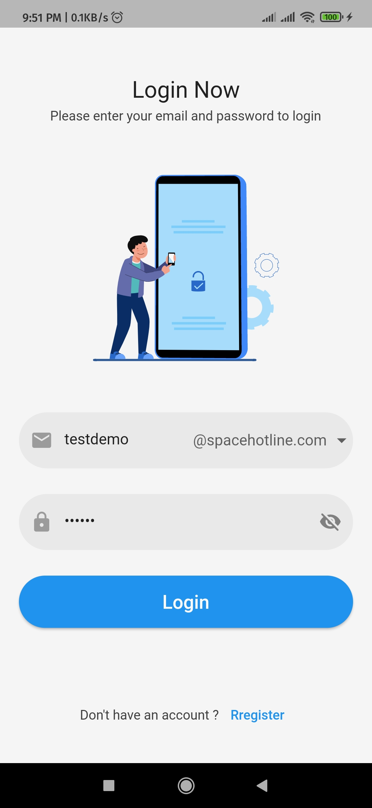

&nbsp;&nbsp;
&nbsp;&nbsp;
<a href="https://choosealicense.com/licenses/mit/" target="_blank"></a>&nbsp;&nbsp;


  

# TempMail

  

</img>

  

<p  align="justify"  >

TempMail is a mobile application. Here, you can create unlimited temporary email address for temporary use.

</p>

<p  align="justify">

<b>Powered by Mail.Tm</b> API for creating temporary email accounts.

  


  

## Features:

  

◉ Create a new account by using this @spacehotline.com domain names at the end.<br>

◉ Registration Screen<br>

◉ Login Screen<br>

◉ Home screen<br>

◉ Drawer for Profile<br>

◉ Receive messages<br>

◉ Message Details Page<br>

◉ Unseen and deleate feature in more vert icon<br>

◉ Cashing for log out<br>

</p>

  

## Published:

  

you can download the apk from google drive [TempMail](https://drive.google.com/file/d/1mZXkIBDX_5Z5jJI_BC_DMOwcgRFJvDwN/view?usp=share_link)

<p align="left">
  
</p>
<p align="left">
  
</p>
<p align="left">
  
</p>
<p align="left">
  
</p>


<br>
Note: It's an open-source project. Anyone can use this code according to the [MIT License](https://choosealicense.com/licenses/mit/) rules & regulations.

  

## Packages used:

  


// For using cashing login data<br>

[shared_preferences: ^2.0.15](https://pub.dev/packages/shared_preferences)<br>

// For State management<br>

[get: ^4.6.5](https://pub.dev/packages/get)<br>

// For vector and raster Images<br>

[flutter_svg: any](https://pub.dev/packages/flutter_svg)

// For making http requests<br>

[http: ^0.13.4](https://pub.dev/packages/http)<br>

// For converting date and time<br>

[intl: any](https://pub.dev/packages/intl)<br>
  

# Installation

  

◉ Open your workspace folder in 'Command Prompt' or 'Terminal'

◉ Copy & paste this command:

  

```

$ git clone https://github.com/AshiqNoor/tempmail.git

```

  

◉ Open the 'tempmail' folder using your Android Studio or VSCode.

◉ Use this commands in your Android Studio / VSCode terminal:

  

```

$ flutter pub get

$ flutter run

```

  

## Feedback

  

If you have any feedback, please reach out to me at ashiq440@gmail.com

  
  

Note: To run this application on your system, you will need [git](https://git-scm.com/) and [flutter](https://docs.flutter.dev/get-started/install) environment already installed.